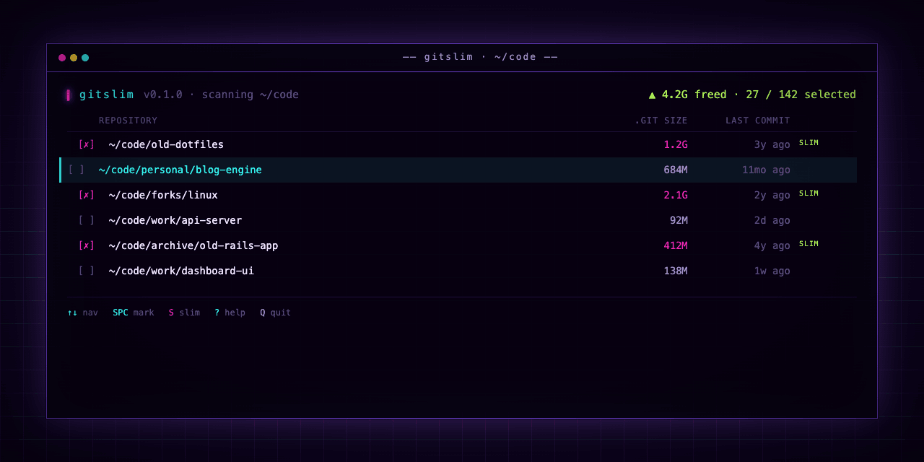

# gitslim



```
         _ _       _ _
    __ _(_) |_ ___| (_)_ __ ___
   / _` | | __/ __| | | '_ ` _ \
  | (_| | | |_\__ \ | | | | | | |
   \__, |_|\__|___/_|_|_| |_| |_|
   |___/

   ─ ─ ─ ─ ─ ─ ─ ─ ─ ─ ─ ─ ─ ─ ─ ─ ✂

   trim your repos. reclaim your disk.
```

An interactive TUI tool for finding git repositories and converting them to shallow clones to reclaim disk space — inspired by [npkill](https://github.com/voidcosmos/npkill).

## How it works

`gitslim` scans a directory tree for git repositories, then presents an interactive list showing each repo's `.git` folder size, how long ago it was last committed to, and when the working tree was last modified. You mark the repos you want to slim and press `S` — it converts them to shallow clones in place.

The slim operation uses:

```bash
git pull --depth 1          # re-fetch with shallow history, discarding old commits
git tag -d $(git tag -l)    # remove all tags (they hold references to old objects)
git reflog expire --expire=all --all
git gc --prune=all          # garbage-collect unreachable objects
```

The depth defaults to 1 but is configurable — see [Configuration](#configuration).

This matches the technique from [afriza's gist](https://gist.github.com/afriza/6c13369d060c3361a06892e039ab9cf0).

## Requirements

- bash 3.0+ (macOS ships with 3.2, so no extra install needed)
- Standard Unix tools: `git`, `find`, `du`, `tput`, `stty`, `sort`
- A terminal with ANSI color support

## Installation

### Symlink from a clone (recommended)

Cloning and symlinking means `git pull` keeps the installed copy up to date automatically:

```bash
git clone https://github.com/georgestephanis/gitslim.git
ln -s "$PWD/gitslim/gitslim" /usr/local/bin/gitslim
```

Use `~/bin/gitslim` instead if that's on your `$PATH` and you prefer a user-local install.

### Copy

```bash
cp gitslim /usr/local/bin/gitslim
chmod +x /usr/local/bin/gitslim
```

## Usage

```bash
gitslim            # scan $HOME
gitslim ~/code     # scan a specific directory
```

### Keyboard controls

| Key | Action |
|-----|--------|
| `↑` / `↓` or `j` / `k` | Navigate the list |
| `Space` | Mark / unmark a repo for slimming |
| `S` | Slim all marked repos |
| `R` | Sort by age (oldest first) |
| `Z` | Sort by `.git` size (largest first) |
| `P` | Sort by path (alphabetical) |
| `Q` or `Ctrl-C` | Quit |

### Status indicators

A 4-character label appears at the right of each row when the repo has a notable state. A legend is shown at the bottom of the screen whenever any of `done`, `n/rm`, or `push` are present:

| Label | Meaning |
|-------|---------|
| `SLIM` | Marked and eligible — will be slimmed when you press `S` |
| `done` | Already a shallow clone — nothing to do |
| `n/rm` | No remote configured — cannot slim |
| `push` | Has unpushed commits — slim is blocked until they are pushed |

### What gets skipped during slimming

- Repos already marked as shallow
- Repos with no remote (`git pull` requires one)
- Repos with uncommitted changes
- Repos with local commits not yet pushed upstream (would be lost)

## Configuration

Create `~/.config/gitslim/config` (or `~/.gitslim`) to customise the slim depth:

```ini
# Keep the last 5 commits locally instead of just 1
depth = 5

# — or — keep everything from the last 3 months:
# since = 3m
```

`since` accepts shorthand (`Nd`, `Nw`, `Nm`, `Ny` for days/weeks/months/years) or any git-understood date string (`2024-01-01`, `6 months ago`). When `since` is set it takes precedence over `depth`.

## Caveats

- **Slimming is destructive.** It removes commit history beyond the configured depth. You cannot recover old history without re-cloning.
- **Requires network access** during the slim operation (`git pull` fetches from the remote).
- **Tags are deleted.** If you care about tags, back them up first or don't slim that repo.
- Repos in detached HEAD state or with complex merge situations may fail; the error output from git is shown so you can diagnose.
